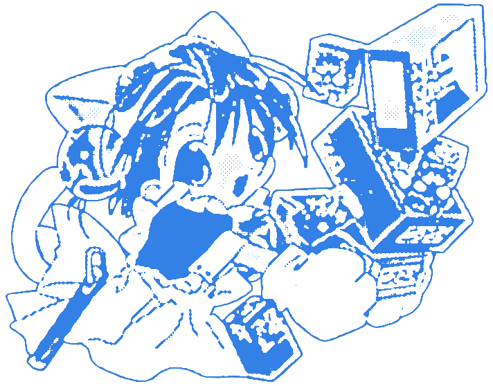

  

# Kaomoji Generator

A web-based Japanese emoticon generator and collection tool. Create custom kaomojis or select from a curated library with filtering and audio feedback.

## Features

- **Interactive Generator**: Build custom kaomojis by selecting facial components
- **Premade Collection**: Browse and filter an extensive kaomoji library
- **One-Click Copy**: Copy to clipboard with visual and audio feedback
- **Smart Filtering**: Filter by tags with URL persistence
- **Audio Feedback**: Success/error sounds for copy operations

## Quick Start

**Use online**: Visit https://mozartsempiano.github.io/kaomoji-generator/

**Local development**:

1. Clone or download the project files
2. Open `index.html` in a modern web browser
3. No build process required

## Usage

- **Generator**: Use dropdown menus to select components and click preview to copy
- **Collection**: Click any kaomoji to copy, use Filter button for categories
- **Tags**: Click tags below kaomojis to filter by category

## Customization

## License

This project is licensed under the [MIT License](LICENSE).
